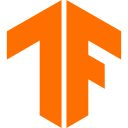
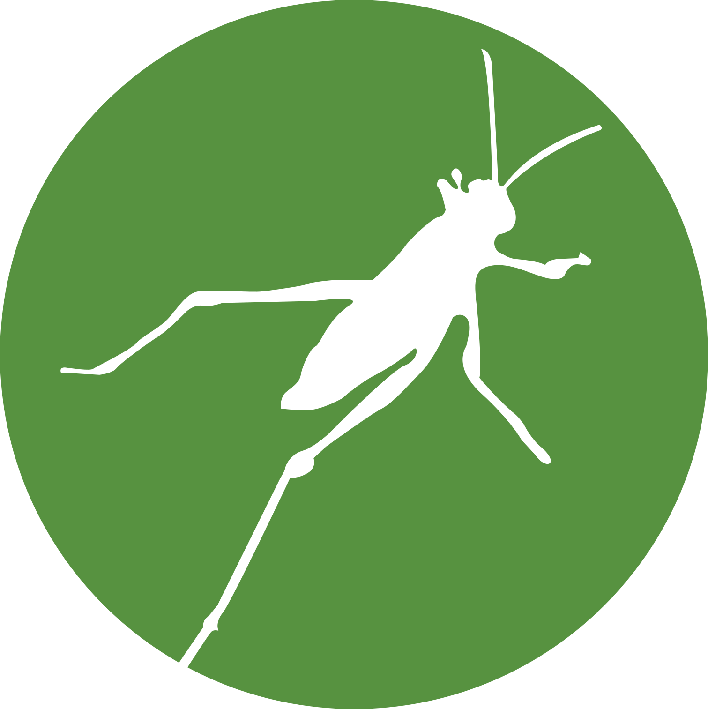

<h1 align="center">
  <i>
    A wealth of information creates a poverty of attention — so <a href="https://proceedings.neurips.cc/paper_files/paper/2017/file/3f5ee243547dee91fbd053c1c4a845aa-Paper.pdf">Attention is all you need</a>.
  </i>
</h1>

## 👋 Hi
I focus on building **AI applications (DL & RL)** and **Full-stack engineering**.

If you're working on something interesting, or have tough technical problems to explore:

📫 [yangyupeng290@gmail.com](mailto:yangyupeng290@gmail.com)
🌐 Personal site: [homepage](https://yup2905.github.io/yupfolio/) (*legacy, new version in progress*).

  <strong>Tech Stack</strong> 
  (not limited to)
    
  <code></code>
  <code></code>
  <code></code>
  <code></code>
  <code></code>
  <code></code>
  <code></code>
  <code></code>
  <code></code>
  <code ></code>
  <code></code>

💡 Always curious, always building. Let's create something amazing together! 🚀

## 🎯 2026 Goals

- 🌞 **Develop an online simulation application**

  Build an interactive platform for online building simulation using **Ladybug’s Python library** and **Vue**.

- 🧠 **Build a reinforcement learning environment for lighting control**

  Design and implement a lighting control RL environment based on the **OpenAI Gym standard**.

- 🛠️ **Review C#**

  Systematically revisit **C#** fundamentals and development practices.

- 🌐 **Rebuild personal website**

  Refactor and improve the structure and functionality of the existing personal site.

- 🔍 **Others**
